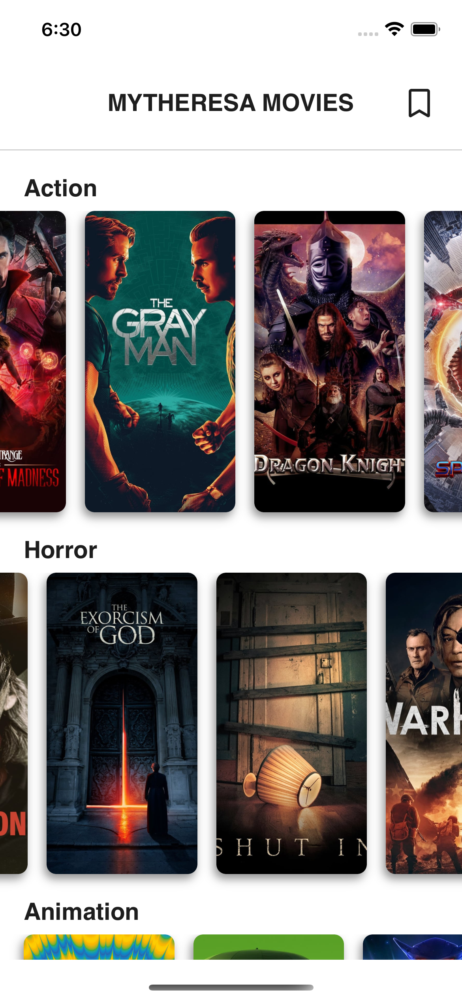
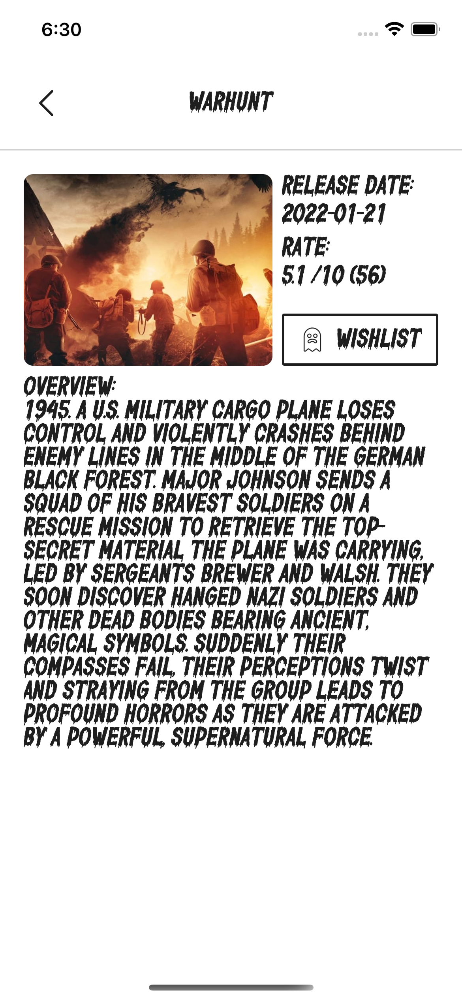
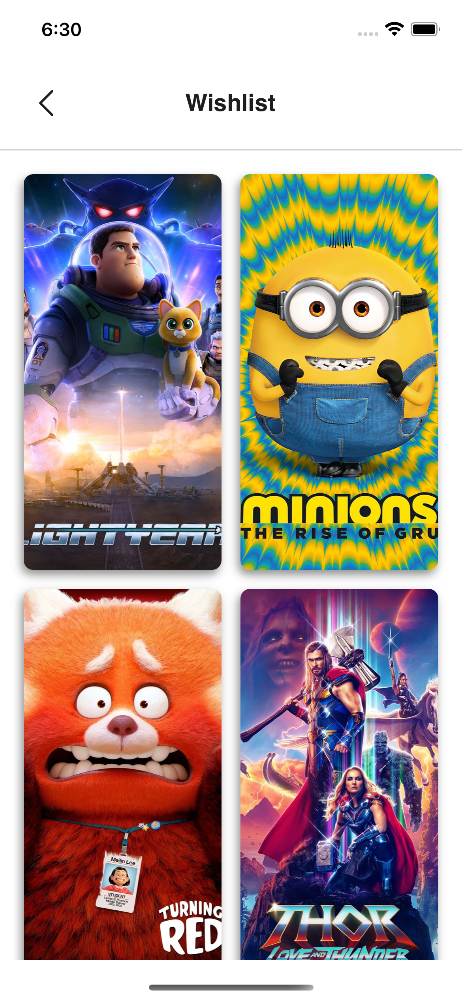
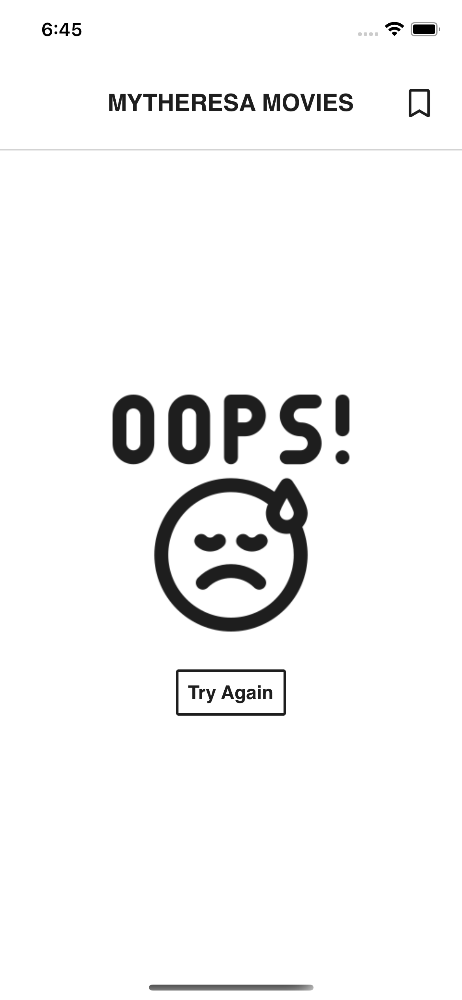
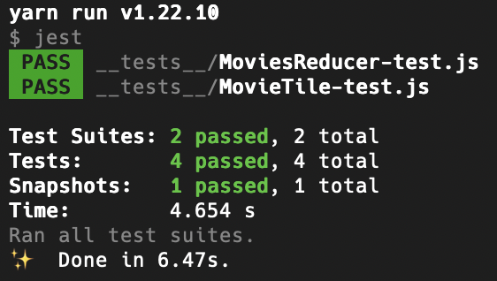

## Installation

Run below commands:

- `yarn install`
- `cd ios/ && pod install`
- `react-native run-android`
- `react-native run-ios`

## Navigation

For the navigation, native stack navigator of `react-navigation` is used. The main reason to do so is that I did not need fancy transitions, web support and customization over navigation between screens so I went for the native one as it has better performance.

## Redux

I wrote both actions and reducers in one file (following `Redux Ducks` routine) instead of writing them in three files (one for **action creators**, one for **reducers** and one for **action definitions**). This significantly reduces complexity of code architecture. (enhances code readability)

## UI Components Architecture

I've made a UIKit where tiny building blocks of the application reside. The names start with **MY** which shows that they are specific to _MYTHERESA_. These components are usually atomic and their main objective is to centralize the props of app's most commonly used components and in case a global change is needed in the future, make it super easy and fast to do so. For example, during the developing of this project, I changed the `MYImage` component few times without touching any other area in the code. Another example, is `MYText` which uses pre-defined presets (which will probably be provided by the design team) and either gets a dictionary key (refer to the [Localization](#localization)) or a plain text and almost there is no need to provide text styling. These presets also acted well in theming the `MovieDetailPage`.

## Data Fetching

For API calls, I used an httpClient (axios instance) to make the requests. The **redux toolkit**'s `createAsyncThunk` is responsible to initiate an axios call and it generates three actions for `pending`, `rejected` and the `fulfilled` states of a request call. Data goes through a processing stage (e.g. convert relative image paths to full path URLs using config state) before passing it to the fulfilled reducer.

There is a response interceptor to handle the errors and a function named `handleError` is used as a central to point manage the errors. In our specific case a Toast shows the error message. Overall mindset is to make things centralized as project grows things become harder to maintain without doing so.
But this centralization comes at a cost and that is less control over the flows.

The main reason why I did not use RTK Query, is its complexity. It's super verbose and had no added value to our project.

## Performance Enhancement

To do a performance optimization I memoized some components and methods using `React.memo` and `useCallback`.

## Screenshots

<table>
  <tr>
    <td>Home  </td>
     <td>Movie Details</td>
  </tr>
  <tr>
    <td valign="center"></td>
    <td valign="center"></td>
  </tr>
 </table>

<table>
  <tr>
    <td>Wishlist</td>
     <td>Error</td>
  </tr>
  <tr>
    <td></td>
    <td valign="center"></td>

  </tr>
 </table>

## Testing UI

To test the UI, I wrote a snapshot test for the `MovieTile` component. The test setup is **Jest** and **Enzyme**. Also MoviesReducer is partially tested. (Due to my current heavy work load I was just able to write some sample test cases)

## Localization

For localization the `react-i18next` is used. The keys of the dictionary are automatically suggested by the `TxKeyPath` type which make it super fast for the developer to write the a text from the dictionary.
